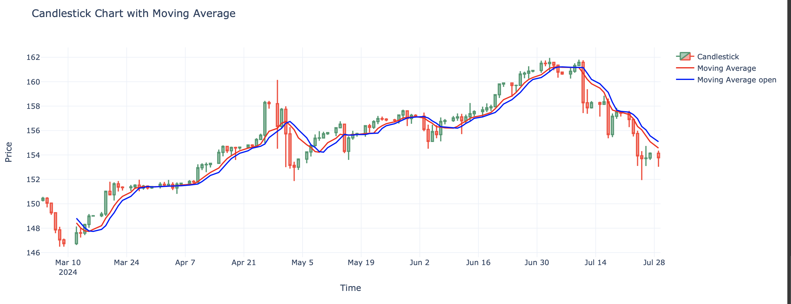

# Moving Average Calculation and Candlestick Chart

This repository contains a Jupyter notebook (`moving_average.ipynb`) that demonstrates how to calculate the moving average for a dataset and visualize it using a candlestick chart with Plotly. This notebook leverages the `HsTrader` library, a powerful tool for financial data analysis and trading strategies.

## HsTrader Library

`HsTrader` is a Python library designed for financial data analysis and trading strategy development. It provides a wide range of tools for technical analysis, including moving averages, candlestick patterns, and other indicators. This notebook uses `HsTrader` to facilitate the calculation of moving averages and the visualization of financial data.

### What is a Moving Average?

A moving average (MA) is a widely used indicator in technical analysis that helps smooth out price data by creating a constantly updated average price. The average is taken over a specific period, such as 10 days, 20 minutes, 30 weeks, or any time frame the trader chooses. There are two main types of moving averages: Simple Moving Average (SMA) and Exponential Moving Average (EMA).

### Benefits of Moving Averages

- **Trend Identification**: Moving averages help in identifying the direction of the trend. If the moving average is moving upwards, it indicates an uptrend, whereas a downward moving average indicates a downtrend.
- **Support and Resistance Levels**: Moving averages can act as dynamic support and resistance levels. Prices often tend to bounce off the moving average levels.
- **Signal Generation**: They can be used to generate trading signals. For example, a common trading signal is the crossover of short-term and long-term moving averages.
- **Smoothing Effect**: Moving averages smooth out price data, which helps in reducing the "noise" of random price fluctuations, giving a clearer picture of the market direction.

### What Does a Moving Average Represent?

A moving average represents the average price of a security over a specified period. For example, a 10-day moving average is the average closing price over the last 10 days. It provides a lagging indicator, meaning it is based on past prices, which can help traders confirm trends and make trading decisions based on historical price movements.

## Table of Contents

- [Introduction](#introduction)
- [Setup](#setup)
- [Usage](#usage)

## Introduction

The purpose of this notebook is to:

1. Calculate the moving average of the 'close' and 'open' prices in a given dataset using the `HsTrader` library.
2. Visualize the data using a candlestick chart with the moving average overlayed.

## Setup

To run this notebook, you need to have Python and Jupyter Notebook installed on your system. You also need to install the required Python packages.

## Usage

1. Open the `moving_average.ipynb` notebook in Jupyter Notebook.
2. Run the cells sequentially to:
   - Generate a sample dataset.
   - Calculate the moving average for the 'close' prices using `HsTrader`.
   - Visualize the dataset using a candlestick chart with Plotly, including the moving average.
